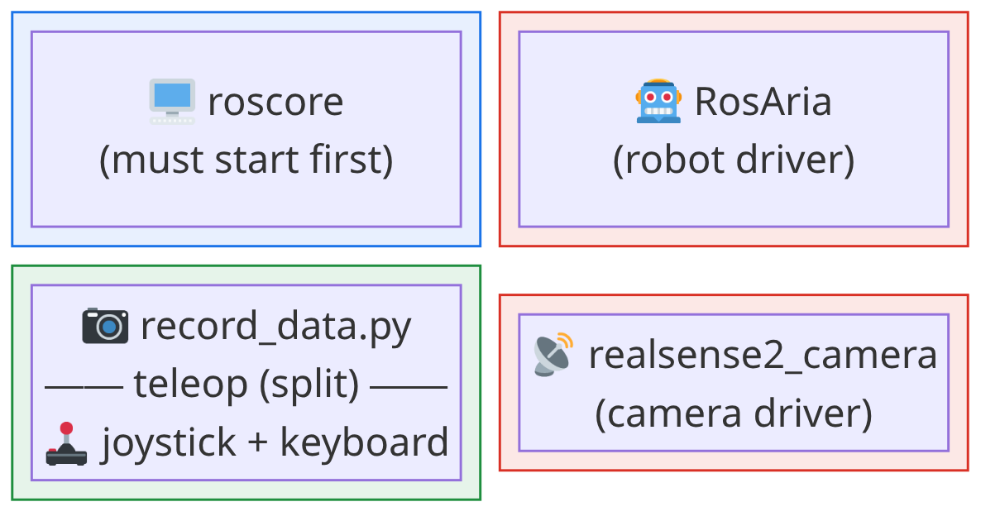
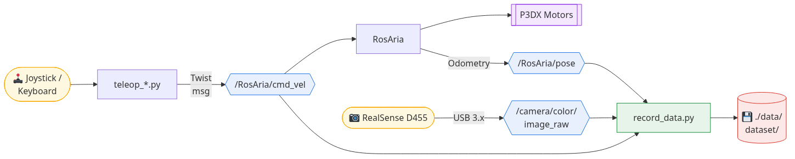

<!-- _class: lead -->

# P3DX Data Collection Stack

### How ROS, hardware drivers, and Docker work together
to collect robot datasets

---

## What is ROS?

**ROS (Robot Operating System)** is not an OS.

It is a **message-passing middleware**. A system that lets independent programs running on the same machine (or network) talk to each other through named channels.

<br>

> Think of it like a pub/sub message bus where each program only needs to know the *name* and *type* of the channel it cares about — not who else is on the other end.

<br>

| Without ROS | With ROS |
|---|---|
| Every program must know about every other program | Programs are decoupled — publish/subscribe to named topics |
| Custom serial/socket protocols per device | Standardised message types shared across all drivers |
| Restart everything to swap a component | Swap one node without touching the rest |

---

## Core Concepts

<div class="columns">

<div>

### Node
A single running process with a specific job.
Each driver, each script = one node.

Examples in this stack:
- `rosaria` — robot motor driver
- `realsense2_camera` — camera driver
- `teleop_joystick` — joystick reader
- `p3dx_data_recorder` — frame saver

</div>

<div>

### Topic
A named, typed channel.
Nodes publish to it or subscribe from it.

Examples in this stack:
- `/camera/color/image_raw`
- `/RosAria/cmd_vel`
- `/RosAria/pose`

### Message
A typed struct carried on a topic.
Defined by ROS packages, reused everywhere.

</div>

</div>

---

## roscore — The Backbone

`roscore` is the **central name registry**. Every node connects to it on startup to:
- Announce what topics it publishes
- Find what topics it wants to subscribe to

```
roscore running at http://192.168.1.10:11311

Node A says: "I publish /camera/color/image_raw"
Node B says: "I want to subscribe to /camera/color/image_raw"
roscore connects them → messages flow directly A → B
```

<br>

> **roscore must be the first thing started.**
> Nothing in ROS works without it. If roscore dies, all communication stops.

---

## ROS Message Types

ROS defines standard message types shared across all packages.

| Message Type | Fields | Used for |
|---|---|---|
| `sensor_msgs/Image` | `data[]`, `header.stamp`, `encoding` | Camera frames |
| `nav_msgs/Odometry` | `pose.pose.position`, `pose.pose.orientation` | Robot location |
| `geometry_msgs/Twist` | `linear.x`, `angular.z` | Velocity commands |

<br>

Because message types are standardised, any teleop node can drive any robot driver — as long as they agree on the topic name and message type.

Our teleop publishes `geometry_msgs/Twist` → RosAria consumes it → motors move.
Neither cares how the other is implemented.

---

## The Data Collection Stack — Overview


---

## Package: RosAria (Robot Driver)

**What it is:** A ROS node that wraps the ARIA library — the native SDK for Pioneer/P3DX robots.

**What it does:**
- Opens `/dev/ttyUSB0` (serial port to the robot's motor controller)
- Reads wheel encoder data → computes odometry → publishes pose
- Listens for velocity commands → sends them to the motors

<div class="columns">

<div>

**Publishes:**
```
/RosAria/pose
  nav_msgs/Odometry
  → x, y, z position
  → quaternion orientation
```

</div>

<div>

**Subscribes:**
```
/RosAria/cmd_vel
  geometry_msgs/Twist
  → linear.x  (m/s forward)
  → angular.z (rad/s turn)
```

</div>

</div>

<br>

> Built from source inside Docker because it is not in the default Noetic apt repository.

---

## Package: realsense2_camera (Camera Driver)

**What it is:** Intel's official ROS wrapper around `librealsense2`.

**What it does:**
- Opens the RealSense D455 over USB 3.x
- Grabs colour (and optionally depth) frames
- Publishes them as standard ROS image messages

**Publishes:**
```
/camera/color/image_raw    ← RGB frames  (sensor_msgs/Image)
/camera/aligned_depth_to_color/image_raw  ← depth (optional)
```

**Started with `roslaunch`** (not `rosrun`) because the launch file configures resolution, frame rate, and alignment in one go:

```bash
roslaunch realsense2_camera rs_camera.launch \
  color_width:=320 color_height:=240 color_fps:=15 align_depth:=true
```

> **Requires USB 3.x.** A USB-C cable rated for USB 2.0 only will detect the camera but streaming will fail.

---

## Scripts: Teleop Nodes

Two teleop scripts, same job — read input, publish velocity.

<div class="columns">

<div>

### teleop_keyboard.py
- Puts the terminal in raw mode (`tty.setcbreak`)
- Reads single keypresses without Enter
- Maps `w/s/a/d/space` → Twist values
- Publishes at 20 Hz

</div>

<div>

### teleop_joystick.py
- Reads Linux joystick events from `/dev/input/js0`
- Maps axes → linear/angular with deadzone + centre calibration
- Can run keyboard input in the same loop (`--keyboard` flag)
- Publishes at 20 Hz

</div>

</div>

<br>

Both publish `geometry_msgs/Twist` to `/RosAria/cmd_vel`.
RosAria picks it up and moves the motors. The scripts know nothing about the hardware.

```python
twist = Twist()
twist.linear.x  = forward_speed   # m/s
twist.angular.z = turn_rate        # rad/s
self.pub.publish(twist)
```

---

## Script: record_data.py

The recorder subscribes to all three topics simultaneously and saves synchronised data at a fixed rate (default 1.5 Hz).

```python
rospy.Subscriber("/camera/color/image_raw", Image,    self.rgb_callback)
rospy.Subscriber("/RosAria/pose",           Odometry, self.odom_callback)
rospy.Subscriber("/RosAria/cmd_vel",        Twist,    self.cmd_callback)
```

**Each callback** just stores the latest value in memory (protected by a `Lock` because ROS callbacks run on a background thread).

**The main loop** wakes up at `poll_hz` (30 Hz), checks if enough time has passed since the last save, then writes:

```
images/000042.jpg        ← RGB frame resized to 320×240
frames.jsonl             ← {"frame_idx":42, "stamp":..., "odom":{...}, "cmd":{...}}
dataset_meta.json        ← recording parameters (written on shutdown)
```

> `cv_bridge` converts `sensor_msgs/Image` → numpy array so OpenCV can encode it as JPEG.

---

## How a Single Frame Gets Recorded


---

## Docker — Why and How

<div class="columns">

<div>

### Why
- ROS Noetic, RosAria, and the RealSense driver have many system-level dependencies
- Installing them directly on the robot laptop risks breaking other system packages
- The Docker image freezes a known-working environment

</div>

<div>

### Key run flags
```bash
--network host
```
ROS uses the host's IP for node discovery. Docker's default NAT breaks this.

```bash
--privileged -v /dev:/dev
```
Gives the container access to USB devices (`/dev/ttyUSB0`, `/dev/input/js0`, RealSense).

```bash
-v "$PWD:/workspace/..."
```
The repo is mounted live — no rebuild needed for script changes.

</div>

</div>

---

## tmux Layout

`start_tmux.sh` creates one tmux window with four panes, each `docker exec`-ing into the container.
All four processes run inside the same container, talking to each other through ROS topics via `roscore`.



---

## Putting It All Together

Every 1/1.5 seconds, a snapshot of **what the robot saw**, **where it was**, and **what command was sent** is written to disk — a complete record for training or analysis.



---

<!-- _class: lead -->

## Summary

| Component | Role |
|---|---|
| `roscore` | Name registry — must run first |
| `RosAria` | Bridges serial port ↔ ROS topics |
| `realsense2_camera` | Bridges USB camera ↔ ROS image topic |
| `teleop_*.py` | Reads input → publishes `/RosAria/cmd_vel` |
| `record_data.py` | Subscribes to all topics → writes dataset |
| Docker | Isolates and packages the entire ROS environment |
| tmux | Runs all nodes in one visible terminal window |
